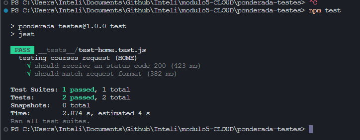

# Ponderada Atividade: Caso de Teste de Software

O caso de teste escolhido foi o acesso e o funcionamento correto do endpoint de GET da entidade de cursos do projeto. Esse endpoint é importante pois é usado para criar a tabela de setores e tipos na home.

## Objetivo

O objetivo do teste é verificar 

1. A existência e comunicação com endpoint /courses da API, esperando o código 200.
2. Verificar o formato das informações recebidas.

## Pré Condição

Como este é um repositório à parte ao projeto desenvolvido no módulo, é necessário estar com a API do projeto funcionando e escutando a porta 3000 no mesmo ambiente que esse repositório, já que ele irá acessar o endereço http://localhost:3000. Caso queira testar em outras condições, é possível alterar o endereço do request no arquivo axios.js.

Para o correto funcionamento deste repositório, é necessário utilizar o comando na raíz do repositório:

```
npm install
```

## Procedimento de Teste

Para realizar o teste, certifique-se que a API do projeto OMP esteja corretamente ligada e escutando a porta 3000 e execute os comandos:

```
npm install
```

e em seguida:

```
npm test
```

Dessa maneira, todas as bibliotecas necessárias estarão baixadas e o ambiente configurado, além do script de teste estar rodando. Dessa forma, acompanhe os logs do terminal utilizado pois através dele, o script inserido na pasta __tests__ irá ser executado e mostrará seus resultados.

## Resultado esperado

O resultado esperado é que todos os testes passem e para tal, duas condições devem ser respeitadas:

1. O endpoint acessado deve retornar uma resposta com status 200.
2. O body da resposta recebeda deve seguir o seguinte padrão:


```
[{
    "id": 1,
    "name": "Engenharia de Software",
    "observation": null,
    "order": 2,
    "createdAt": "2023-09-06T08:58:09.000Z",
    "updatedAt": "2023-09-06T09:07:46.000Z",
    "projectsKPIs": {
        "businessTypes": [
            {
                "name": "Pública",
                "amount": 4
            },
        ],
        "businessSectors": [
            {
                "name": "Tecnologia",
                "amount": 2
            },
        ]
    },
    "modules": [
        {
            "id": 5,
            "name": "Desenvolvimento de serviços em cloud computing",
            "description": null,
            "order": 5,
            "courseId": 1,
            "createdAt": "2023-09-06T10:07:48.000Z",
            "updatedAt": "2023-09-06T10:07:48.000Z"
        }
    ]
}]
```

Nota: os campos observation e description podem ser string ou null.


## Resultado obtido

Conforme o resultado esperado, o acesso ao endpoint ocorreu bem e satisfez os critérios definidos para o teste, retornando sucesso nos dois casos testados e mostrando o resultado no terminal, conforme a biblioteca jest:   



Confome o resultado da print acima, verifica-se que o endpoint não possui erros e funciona conforme o esperado.

## Pós Condição

O sistema manteve-se estável ao final dos testes e todas as testagens foram bem sucedidas.
